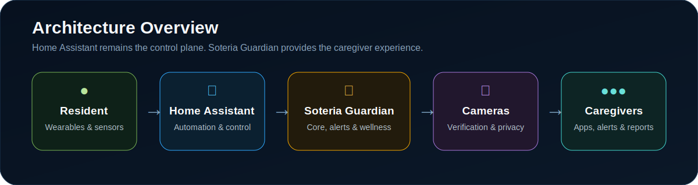

<p align="center">
  
</p>

<h1 align="center">Soteria Guardian</h1>
<p align="center"><strong>Protecting Independence. Preserving Peace of Mind.</strong></p>

<p align="center">
  
  
  
  
  
  
</p>

<p align="center">
  <a href="#overview">Overview</a> •
  <a href="#features">Features</a> •
  <a href="#architecture">Architecture</a> •
  <a href="#supported-ecosystem">Devices</a> •
  <a href="#repository-structure">Repository</a> •
  <a href="#roadmap">Roadmap</a> •
  <a href="CONTRIBUTING.md">Contributing</a>
</p>

---

## Overview

Soteria Guardian is an open, modular, **Home Assistant-first** platform for elderly safety, wellness monitoring, emergency response, and caregiver support.

It combines smart-home devices, deterministic emergency workflows, camera verification, caregiver notifications, and future AI-assisted wellness insights into one privacy-conscious ecosystem.

<table>
<tr>
<td width="50%" valign="top">

### Why it exists

- Help elderly residents remain independent longer
- Give caregivers clear, actionable information
- Reduce dependence on voice-only alerts
- Keep critical automations local whenever possible
- Provide layered protection instead of trusting one device

</td>
<td width="50%" valign="top">

### Design principles

- **Local first**
- **Privacy by design**
- **Accessible by default**
- **Deterministic emergency logic**
- **Vendor-neutral architecture**
- **Auditable alert lifecycle**

</td>
</tr>
</table>

## Features

<table>
<tr>
<td width="33%" valign="top"><strong>🚨 Emergency SOS</strong><br><br>Wearable, fixed-button, app, and sensor-triggered emergency workflows with acknowledgment and escalation.</td>
<td width="33%" valign="top"><strong>📷 Camera Verification</strong><br><br>Fast access to camera status, snapshots, and live verification during active alerts.</td>
<td width="33%" valign="top"><strong>📱 Caregiver Dashboard</strong><br><br>Resident location, last movement, device health, battery state, and active alerts in one view.</td>
</tr>
<tr>
<td width="33%" valign="top"><strong>🧠 Wellness Insights</strong><br><br>Routine monitoring, inactivity checks, trend summaries, and future AI-assisted event correlation.</td>
<td width="33%" valign="top"><strong>💡 Accessible Alerts</strong><br><br>Visual light patterns and tactile controls for residents who may not hear smart speakers reliably.</td>
<td width="33%" valign="top"><strong>🔒 Privacy First</strong><br><br>Local automations, least-privileged access, secure credentials, and explicit stale-data indicators.</td>
</tr>
</table>

## Architecture

<p align="center">
  
</p>

**Home Assistant is the control plane.** It owns device integration, local automations, entity state, and emergency scripts.

**Soteria Guardian is the caregiver plane.** It provides visibility, alert acknowledgment, reports, configuration, and future wellness intelligence.

## Supported Ecosystem

| Component | Role |
|---|---|
| **Aqara Camera Hub G350** | Living-room video verification and local recording |
| **Aqara FP2** | Bedroom and living-room presence, zones, and inactivity logic |
| **Aqara Wireless Mini Switch** | Wearable or fixed SOS control |
| **Amazon Echo** | Secondary voice and announcement layer |
| **Smart lights** | Primary visual feedback for a hearing-impaired resident |
| **Home Assistant on Intel NUC** | Automation, integration, state, and local control |

Planned expansion includes door sensors, leak sensors, smoke/CO integrations, bed and chair occupancy, medication workflows, and a dedicated Soteria Guardian wearable.

## Emergency Lifecycle

```text
Alert Created
      ↓
Delivered to Caregivers
      ↓
Acknowledged
      ↓
Escalated if Needed
      ↓
Resolved
      ↓
Archived and Audited
```

Every critical alert should preserve its trigger source, room context, timestamps, delivery state, caregiver action, and resolution status.

## Core Modules

- **Core Platform** — identity, permissions, configuration, system health, and audit records
- **Resident** — accessibility needs, routines, consent, room state, and wellness profile
- **Caregiver** — notifications, dashboards, acknowledgment, escalation, and reports
- **Home Assistant** — entity discovery, WebSocket state sync, scripts, services, and events
- **Emergency** — SOS initiation, delivery, acknowledgment, escalation, and resolution
- **Wellness** — inactivity checks, routine analysis, summaries, and trend indicators
- **Cameras** — privacy controls, availability, snapshots, live view, and verification
- **Wearables** — Mini Switch integration and future Soteria Guardian hardware
- **AI** — optional summaries and correlation under deterministic safety controls

## Repository Structure

```text
Soteria-Guardian/
├── mobile-app/          # React Native / Expo caregiver app
├── homeassistant/       # Automations, packages, dashboards, helpers, scripts
├── firmware/            # Future wearable and companion-device firmware
├── hardware/            # CAD, STL, BOM, and 3D-printing assets
├── docs/                # Architecture, API, installation, user guides
├── images/              # README and product imagery
├── branding/            # Logos, badges, diagrams, colors, typography
└── .github/             # Issue templates, PR template, workflows
```

## Roadmap

| Version | Focus | Status |
|---|---|---|
| **v0.1.0** | Foundation, architecture, entity mapping | In progress |
| **v0.2.0** | Live caregiver dashboard | Planned |
| **v0.3.0** | Emergency lifecycle and escalation | Planned |
| **v0.4.0** | Wellness monitoring and summaries | Planned |
| **v0.5.0** | Wearable enclosure and expanded device support | Planned |
| **v1.0.0** | Tested public release | Future |

See the detailed [roadmap](docs/ROADMAP.md).

## Security and Privacy

- Local-first processing wherever practical
- Least-privileged Home Assistant credentials
- Secure token storage on mobile devices
- TLS-only remote access
- No credentials embedded in camera URLs
- Explicit offline, unavailable, and stale-data states
- Audit trails for alert creation, acknowledgment, escalation, and resolution
- AI cannot be the sole decision-maker for critical emergency actions

## Safety Notice

Soteria Guardian is **not a medical device**, does not guarantee fall detection, and is not a replacement for **911** or a professionally monitored medical-alert service.

## Contributing

Contributions must preserve safety, privacy, accessibility, and deterministic emergency behavior. Review [CONTRIBUTING.md](CONTRIBUTING.md) before opening a pull request.

## License

MIT License. See [LICENSE](LICENSE).

---

<p align="center">
  Built on Home Assistant. Designed for families. Focused on independence.
</p>
